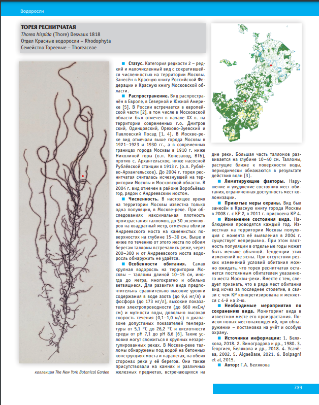
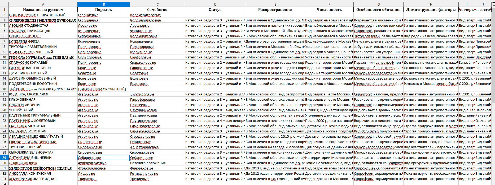

# ParserAnimals

## Цель и задача

Наша команда разрабатывает сайт, на котором будет представлена информация о редких и исчезающих видах животных, занесенных в Красную книгу города Москвы.

Ссылка на Красную книгу Москвы: [Красная книга Москвы](https://www.mos.ru/eco/function/krasnaya-kniga-moskvy/)

Моя задача в этом проекте — подготовить данные для сайта, получив подробную информацию о каждом виде из Красной книги. Информация о животных в Красной книге представлена в формате объемных PDF файлов, и моя задача — автоматизировать процесс извлечения данных из этих документов, чтобы затем структурировать и отобразить их на сайте.

### Основные сложности задачи:

1. **Формат данных** — данные представлены в многостраничных PDF-документах объемом до 1 ГБ, что делает ручную обработку очень трудоемкой.

2. **Структура информации** — данные о каждом виде структурированы, но распределены по документу, что требует создания шаблонов для извлечения нужных полей.

3. **Извлечение изображений** — каждый вид в Красной книге сопровождается изображениями, которые необходимо извлечь и сопоставить с текстовой информацией.

**Пример того, что нужно парсить:**

## Описание работы

Файл: `Parser_v1.py`

1. **Парсинг текстовых файлов**:
Каждый текстовый файл обрабатывается для извлечения информации о различных таксономических категориях (название, порядок, семейство, статус и т.д.) с использованием регулярных выражений. Данные каждого файла сохраняются в отдельный Excel-файл.
2. **Очистка данных**:
В процессе парсинга выполняется удаление лишних символов, ненужных заголовков и номеров страниц. Также удаляются другие ненужные элементы оформления для более точного извлечения информации.
3. **Создание промежуточных Excel-файлов**:
Каждый из 16 текстовых файлов преобразуется в отдельный Excel-файл с заранее определенной структурой данных, что упрощает последующее объединение.
4. **Объединение таблиц**:
Все промежуточные Excel-файлы объединяются в один сводный файл. При этом для каждой записи добавляются дополнительные классификационные поля, такие как раздел ("Млекопитающие", "Птицы" и т.д.). В процессе объединения были добавлены дополнительные столбцы для систематической классификации (например, "Раздел", "Отдел", "Порядок", "Отряд"), где это необходимо.
5. **Результат**:
Создан единый Excel-файл, содержащий все данные из текстовых файлов, готовый для дальнейшего анализа. Этот файл включает более полную и структурированную информацию, что упрощает доступ к данным и позволяет анализировать их по различным таксономическим категориям.

#### Итог работы кода: Excel таблица следующего вида

## Дальнейшие планы

В будущем планируется улучшить алгоритм парсинга, добавив больше функций для более гибкой обработки данных. Планы включают:

1. **Автоматизация работы с PDF** — найти способ автоматического извлечения текста и изображений напрямую из PDF.

2. **Улучшение качества обработки** — добавить обработку дополнительных разделов и категорий, улучшить регулярные выражения для более точного парсинга.

3. **Валидация данных** — добавить проверки и фильтры для устранения ошибок и несоответствий в данных.
и фильтры для устранения ошибок и несоответствий в данных.